# Architecture Diagrams - SecureAI MVP

**Complete set of architecture diagrams derived from repository analysis.**

Time to review: 60-90 minutes

---

## Diagram 1: System Context Diagram

**Shows**: Users, SecureAI system, external systems, and data stores

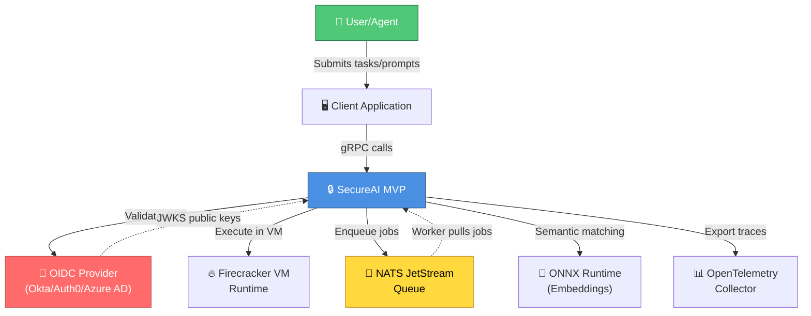

### How to Read This Diagram

**Solid arrows** show primary flows:
- Users submit work through client applications
- Client talks to SecureAI via gRPC
- SecureAI orchestrates with external systems

**Dotted arrows** show optional/reactive flows:
- NATS pushes jobs back to workers
- OIDC provides keys reactively

**Box colors** indicate system type:
- Blue: Core application
- Green: End users
- Red: Security/Auth
- Yellow: Messaging/Queue

### Important Observations

1. **Asynchronous Integration**: NATS is not synchronous request/response - jobs are pushed and pulled, enabling decoupling
2. **Multi-tenant Design**: OIDC provider is external source of truth for identity/tenancy
3. **No Direct Database**: SecureAI doesn't show a traditional database as primary store (audit is append-only file)
4. **Security at Boundary**: OIDC validation happens at entry (gRPC request)
5. **Optional External Dependencies**: ONNX, NATS, Collector are all optional (can be disabled via config)

### Questions to Test Understanding

1. Why is OIDC external instead of built-in authentication?
   - (Answer: Integrates with enterprise SSO; no passwords to manage; multi-tenant by default)

2. What happens if NATS becomes unavailable?
   - (Answer: Queue feature disabled, evals won't be async; system degrades gracefully)

3. Why does SecureAI connect to Firecracker at all if it's just execution?
   - (Answer: Needs to spawn VMs, monitor, tear down; it orchestrates execution)

4. How would this diagram change if we added a relational database?
   - (Answer: Would need explicit "Database" box; queries/persistence arrows; schema management)

5. Can a user work with SecureAI without going through OIDC?
   - (Answer: No - auth is mandatory for gRPC; can disable in config but not skip in code path)

---

## Diagram 2: Container Diagram

**Shows**: Major deployable units, services, databases, queues

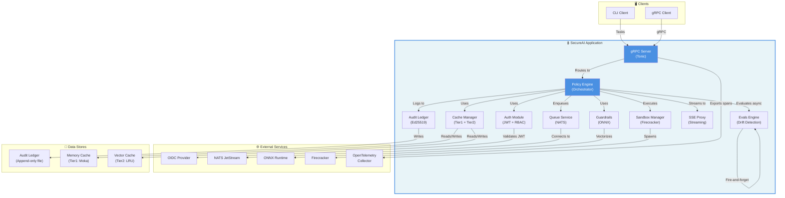

### How to Read This Diagram

**Light blue box** (SecureAIApp): Single deployable container/binary (monolithic)

**Component boxes**: Major subsystems within the application

**Arrows**: Dependencies and data flows between components

**External Services**: Outside the deployment boundary; can be swapped/disabled

**Data Stores**: Persistence mechanisms (some in-memory, some file-based)

### Important Observations

1. **Monolithic but Modular**: Single binary but 10 loosely-coupled modules
2. **Orchestrator Pattern**: PolicyEngine routes all requests through proper layers
3. **Optional Integration**: Auth, Guardrails, Cache, Queue, Evals can all be disabled via config
4. **No Synchronous Database**: Uses append-only file (audit) + in-memory structures (cache)
5. **External Services Are Real Dependencies**: 
   - OIDC is required for auth
   - NATS required for queue
   - Firecracker required for sandbox
   - ONNX required for guardrails

### Questions to Test Understanding

1. Why is PolicyEngine the central orchestrator rather than gRPC server?
   - (Answer: Separates API layer from business logic; allows CLI and gRPC to use same engine)

2. What would happen if CacheModule was removed?
   - (Answer: System would work but slower (no caching); feature is optional)

3. How does data flow from a user request to the audit ledger?
   - (Answer: gRPC → PolicyEngine → Business Logic → AuditModule → File)

4. Why do some modules connect to external services while others don't?
   - (Answer: External services are integration points; internal modules are pure logic)

5. Can EvalsModule work if QueueModule is disabled?
   - (Answer: Yes - evals uses internal tokio channel, not NATS queue)

---

## Diagram 3: Component Diagram - Auth Module

**Shows**: JWT validation, RBAC, permission checking

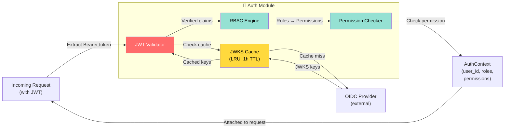

### How to Read This Diagram

**Red box (JwtValidator)**: Cryptographic verification - the security checkpoint

**Yellow box (JwksCache)**: Performance optimization - caches public keys

**Green boxes (RBAC)**: Authorization logic - maps roles to permissions

**Flow**: Request → Validation → Role extraction → Permission mapping → Context attached

### Important Observations

1. **JWKS Caching is Critical**: Every 10th request hits OIDC provider; others use cache
2. **Separation of Concerns**: JWT validation separate from permission checking
3. **Role-Permission Mapping is Immutable**: Hardcoded in RbacEngine, not configurable
4. **Multi-tenant by Default**: tenant_id extracted from JWT claims
5. **Fail-Secure**: Invalid JWT rejects immediately; missing permission denies

### Questions to Test Understanding

1. Why cache JWKS keys at all? Why not fetch every time?
   - (Answer: Performance; JWKS changes rarely; 1h TTL balances freshness and speed)

2. What happens if OIDC provider is down?
   - (Answer: Cached keys still work; only new requests with unknown key IDs fail)

3. How does RBAC know which permissions belong to which roles?
   - (Answer: Hardcoded mapping in RbacEngine; static, not configurable)

4. Can a user have multiple roles?
   - (Answer: Yes - JWT can have multiple roles; permissions are union of all roles)

5. Why is permission checking separate from role extraction?
   - (Answer: Separation of concerns; allows flexible permission model if needed)

---

## Diagram 4: Dependency Graph - All Modules

**Shows**: Which modules depend on which

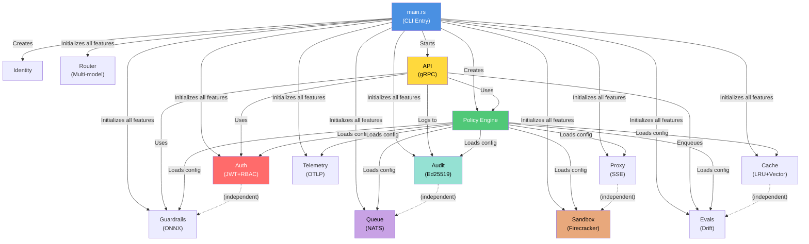

### How to Read This Diagram

**Solid arrows**: Hard dependencies

**Dotted arrows**: No dependencies (independent modules)

**Blue boxes**: Core orchestration layer

**Feature boxes**: Optional modules that can be toggled

### Important Observations

1. **Layered Dependency**: main.rs → policy → features (not circular)
2. **Feature Independence**: Most modules don't depend on each other
3. **API Integration**: All flows go through API layer; APIs orchestrate features
4. **Explicit Initialization Order**: Matters for startup consistency
5. **No Circular Dependencies**: Clean DAG (Directed Acyclic Graph)

### Questions to Test Understanding

1. Could you remove the Auth module without breaking anything else?
   - (Answer: Yes - it's optional, disabled by default, no other modules use it)

2. What depends on Audit module?
   - (Answer: Only policy/API for logging; audit is write-only)

3. Why does policy engine reference all feature configs?
   - (Answer: To load them from secureai.toml; provides configuration abstraction)

4. If you wanted to use Evals without Queue, would it work?
   - (Answer: Yes - evals uses internal tokio channel, not NATS queue)

5. How would adding a new feature (e.g., Webhooks) change this diagram?
   - (Answer: New "webhooks" box; policy loads its config; may depend on some modules)

---

## Diagram 5: Request Lifecycle - Policy Evaluation

**Shows**: Most important flow through the system

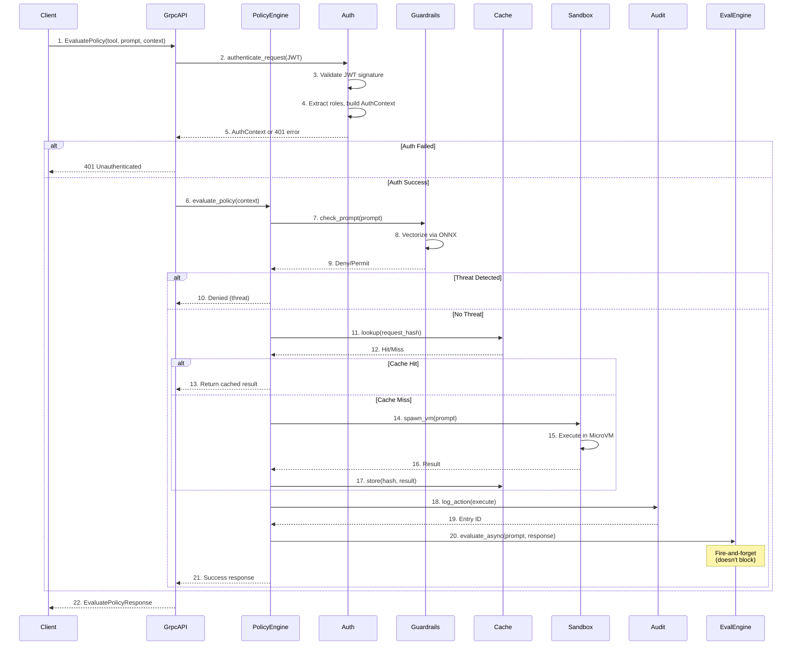

### How to Read This Diagram

**Vertical lines**: Participants (system components)

**Arrows**: Synchronous calls (wait for response)

**Dashed arrows**: Async/fire-and-forget calls

**Boxes**: Decision points (Diamond = if/else)

**Sequence**: Numbered steps show execution order

### Important Observations

1. **Fail-Fast Security**: Auth happens first (fail-secure)
2. **Defense in Depth**: Multiple checks (auth → guardrail → policy)
3. **Caching is Transparent**: Caller doesn't know if result is cached
4. **Async Evaluation**: Evals doesn't block response (fire-and-forget)
5. **Audit is Mandatory**: Every execution logged (unless audit disabled)

### Questions to Test Understanding

1. What happens if guardrails detects a threat?
   - (Answer: Short-circuit; deny immediately; don't execute sandbox)

2. Why is cache lookup before sandbox execution?
   - (Answer: Performance; avoid expensive VM spawn if result cached)

3. Can cache hit and guardrail bypass both happen?
   - (Answer: No - guardrail happens before cache check; if threat, never reaches cache)

4. What if audit fails to log?
   - (Answer: Depends on configuration; can be fire-and-forget or blocking)

5. Why is evals fire-and-forget instead of waiting?
   - (Answer: Evals is optional monitoring; shouldn't block user response)

---

## Diagram 6: Data Flow Diagram

**Shows**: How data moves through the system

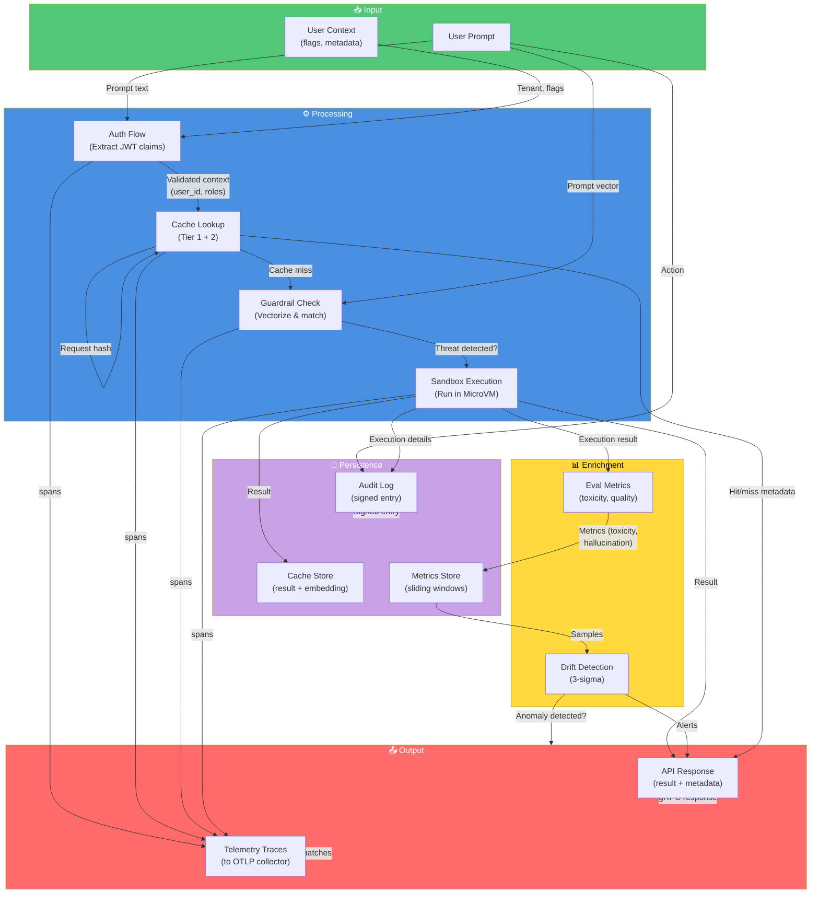

### How to Read This Diagram

**Green (Input)**: Data entering the system

**Blue (Processing)**: Main business logic transformations

**Yellow (Enrichment)**: Optional monitoring/analytics

**Purple (Persistence)**: Data being written to storage

**Red (Output)**: Data leaving the system

**Arrows**: Data transformations and flows

### Important Observations

1. **Multi-path Data Flow**: Same prompt flows through cache, guardrail, and sandbox
2. **Metadata Enrichment**: Evals adds metadata (anomaly alerts) to response
3. **Tracing is Pervasive**: Spans collected from every layer
4. **Audit is Separate Stream**: Doesn't interact with response path
5. **Cache Stores Two Forms**: Both result AND embedding (for semantic search)

### Questions to Test Understanding

1. Where does the user's prompt appear in this diagram?
   - (Answer: Input → GuardrailFlow → SandboxFlow; also embedded for semantic search)

2. Why does cache store both result AND embedding?
   - (Answer: Tier 1 uses result; Tier 2 uses embedding for semantic matching)

3. How does drift detection get its data?
   - (Answer: From EvalFlow metrics; compares against historical windows)

4. What happens to traces if telemetry is disabled?
   - (Answer: Spans still generated but batch processor is disabled; no export)

5. If sandbox execution fails, does data still flow to audit?
   - (Answer: Yes - failure is still an action worth auditing)

---

## Diagram 7: Authentication & Authorization Flow

**Shows**: JWT validation and permission checking

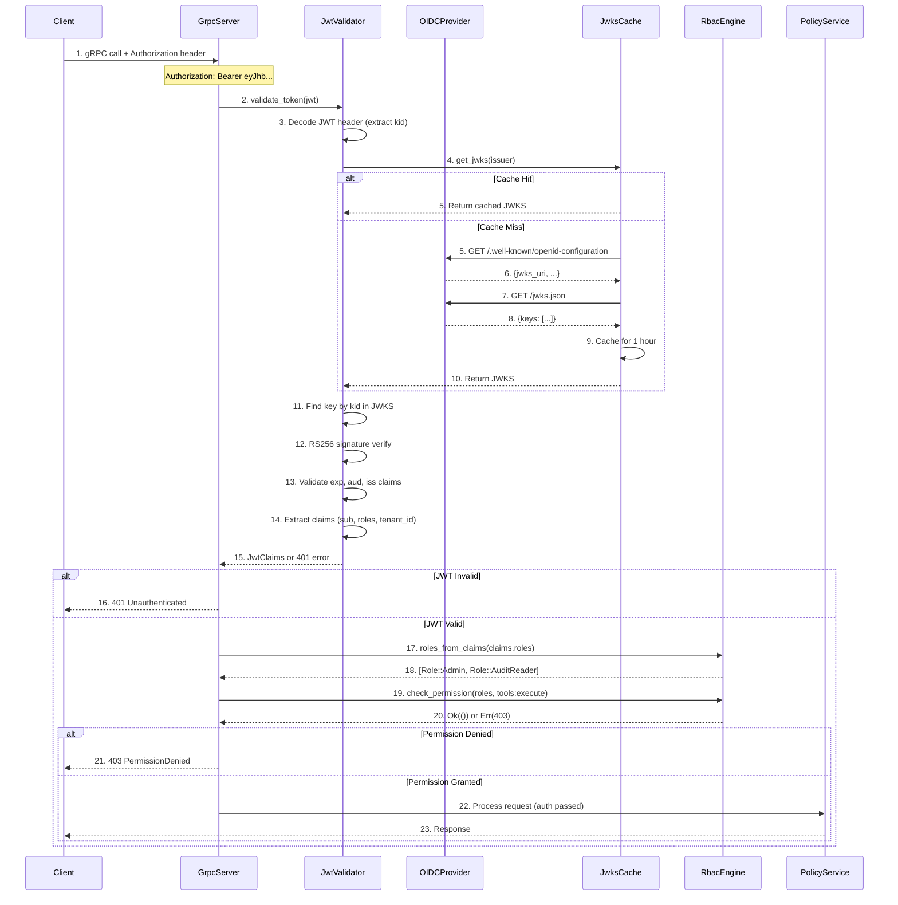

### How to Read This Diagram

**Numbered steps**: Sequential operations

**Decision diamonds (alt blocks)**: Branching logic

**Dotted return arrows**: Responses coming back

**Error paths**: Shown as early returns (401, 403)

### Important Observations

1. **JWKS Caching Matters**: First request to new issuer fetches keys; subsequent requests use cache
2. **Fail-Secure**: Invalid JWT → 401 immediately; missing permission → 403 immediately
3. **Three Validation Levels**: 
   - Cryptographic (signature)
   - Temporal (expiration)
   - Semantic (aud, iss claims)
4. **Immutable Permission Mapping**: Roles hardcoded, not fetched from external source
5. **Multi-tenant by Default**: tenant_id from JWT claim enables isolation

### Questions to Test Understanding

1. What if the OIDC provider's JWKS changes?
   - (Answer: Cache TTL (1h) means old keys used until refresh; new keys picked up on cache miss)

2. Can someone use an expired token if signature is valid?
   - (Answer: No - expiration validated after signature; exp must be in future)

3. How does SecureAI know which permissions a role has?
   - (Answer: Hardcoded mapping in RbacEngine; not fetched from OIDC)

4. What if a user has no roles in their JWT?
   - (Answer: Empty roles list → Guest role → No permissions → 403 on execute)

5. Why validate exp, aud, iss after signature verification?
   - (Answer: Signature proves token came from issuer; claims validate it's for this app and not expired)

---

## Diagram 8: Data Persistence Model

**Shows**: What data is stored and where

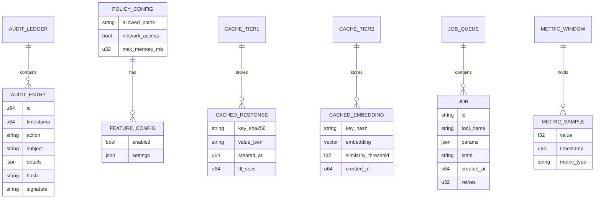

### How to Read This Diagram

**Entities** (boxes): Data structures that are persisted

**Relationships** (lines): How entities relate to each other

**Cardinality** (||, ||--o): One-to-one, one-to-many

**Attributes**: Fields stored for each entity

### Important Observations

1. **Append-Only Ledger**: Audit entries never updated/deleted; immutable chain
2. **TTL-Based Cache**: Responses cached with time-to-live; auto-expired
3. **Dual Indexing**: Cache keyed by hash (Tier 1) and embedding (Tier 2)
4. **Job State Machine**: Jobs have explicit state progression
5. **Metric Windows**: Samples stored in sliding windows for drift detection
6. **No SQL Database**: All persistence is either files, in-memory, or queues

### Important Caveat

**UNKNOWN**: Secondary indices, physical storage format, cache eviction policies (inferred from code but not explicitly documented)

### Questions to Test Understanding

1. How are cache entries evicted when memory is full?
   - (Answer: LRU policy; oldest entries removed first; controlled by cache capacity config)

2. Can you query audit entries by action or subject?
   - (Answer: Not efficiently - it's append-only; would require scan; no indices)

3. What happens to job data after completion?
   - (Answer: Stays in NATS JetStream; subject to retention policy (default 30 days))

4. How long are metric samples kept?
   - (Answer: In sliding windows (1h + 24h); old samples fall out of window)

5. Why is embedding stored separately from response?
   - (Answer: Tier 1 cache doesn't need it; Tier 2 needs it for similarity search)

---

## Diagram 9: Sequence Diagrams - Five Important Operations

### 9a: Task Execution in Sandbox

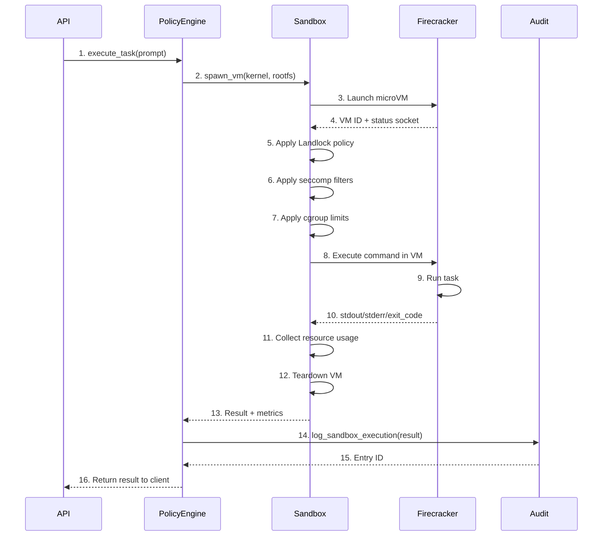

### 9b: Cache Lookup (Two-Tier)

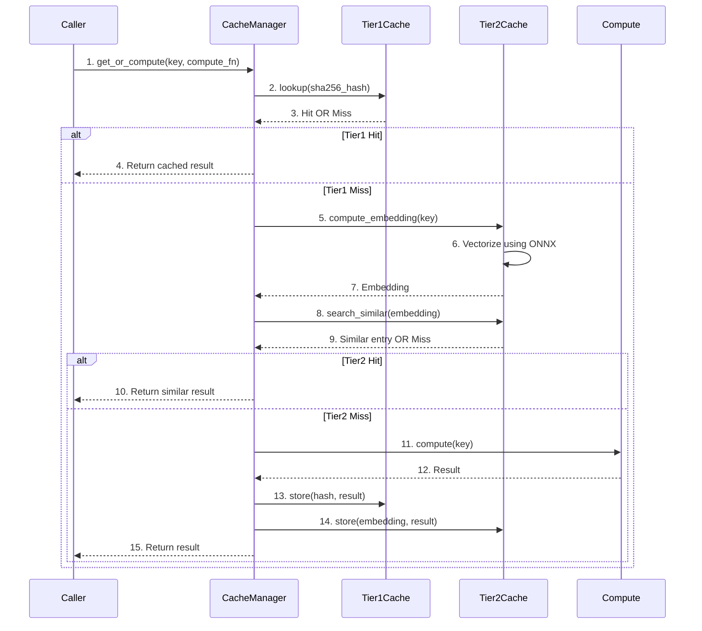

### 9c: Job Queue Processing

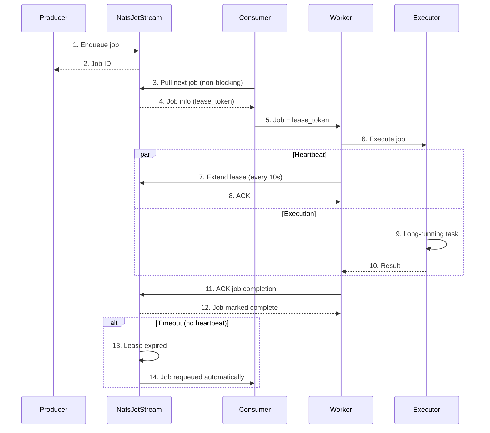

### 9d: Drift Detection (3-Sigma Anomaly)

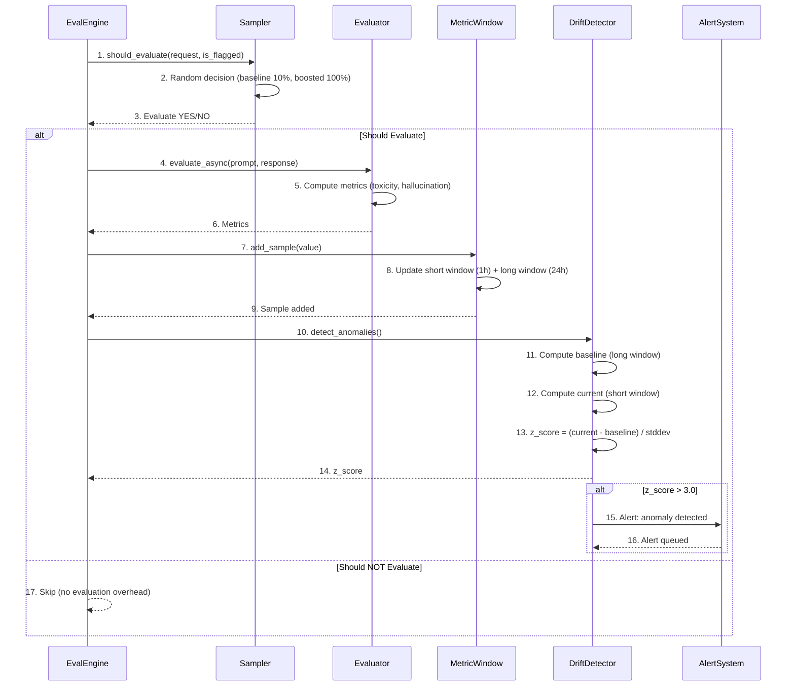

### 9e: RBAC Permission Checking

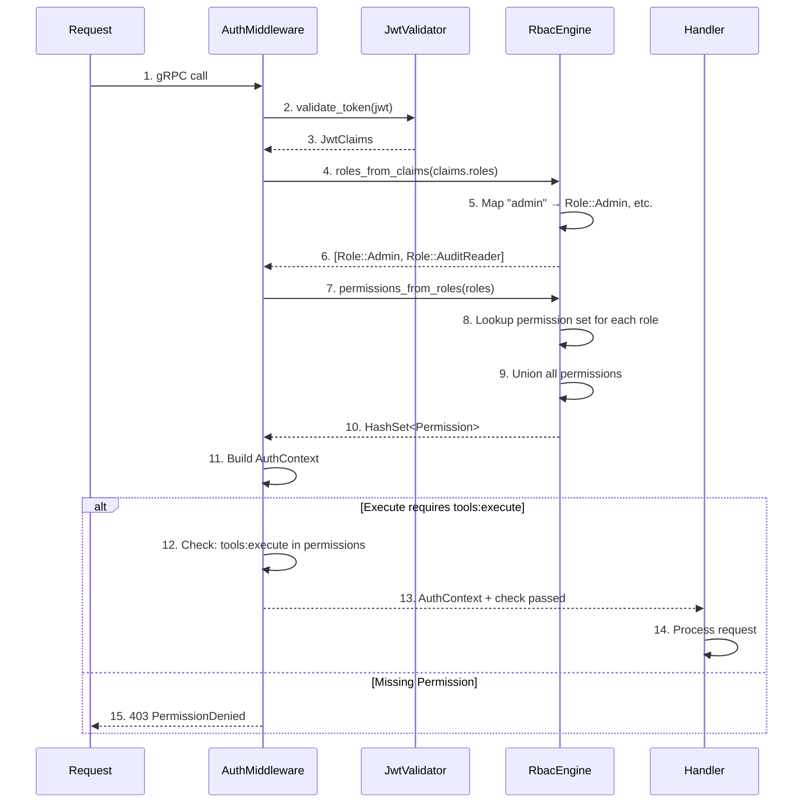

### How to Read These Diagrams

**Sequence diagrams** show time flowing top-to-bottom

**Arrows** = messages/calls between participants

**Boxes** = parallel operations (par block)

**alt/else blocks** = conditional paths

**Numbered steps** = execution order

### Important Observations

1. **Sandbox is Resource-Heavy**: VM spawn takes 500-1000ms per task
2. **Cache is Transparent**: Caller doesn't know if result is cached
3. **Queue Uses Leases**: Heartbeats keep lease alive; timeout auto-requeues
4. **Drift Detection is Async**: Doesn't block request handling
5. **Permission Checking is Eager**: Resolved once at request start; not per-resource

### Questions to Test Understanding

1. What happens if a VM task takes longer than 30 seconds?
   - (Answer: In current design, depends on implementation; likely timeout or heartbeat renewal)

2. Why does Tier 2 cache compute embedding instead of storing it initially?
   - (Answer: Only needed if Tier 1 misses; saves computation for requests that hit Tier 1)

3. Can a job be processed by multiple workers?
   - (Answer: No - NATS lease ensures only one worker; lease prevents duplicate processing)

4. If z_score is 2.5 (below 3.0), what happens?
   - (Answer: No alert generated; within normal variance)

5. Why check permissions once at request start instead of per-resource?
   - (Answer: Simpler; SecurityContext attached to request; no per-resource checks)

---

## Diagram 10: Deployment Architecture

**Shows**: How system is deployed, containerized, and scaled

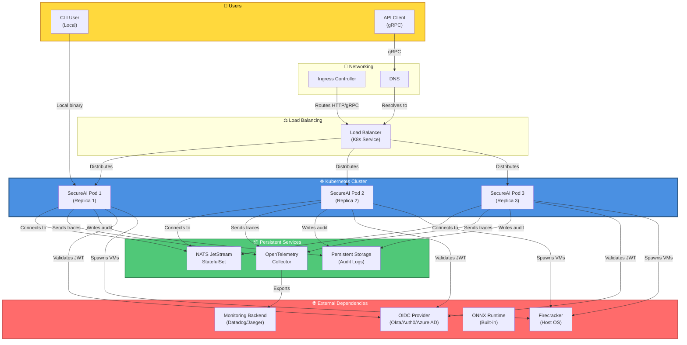

### How to Read This Diagram

**Blue box (K8s Cluster)**: Main deployment target

**Red boxes (External)**: Out-of-cluster dependencies

**Green boxes (Persistent)**: Long-lived services

**Yellow boxes (Users)**: Request sources

**Arrows**: Data flows and connections

### Important Observations

1. **Horizontal Scalability**: Multiple pods behind load balancer
2. **Stateless Pods**: Each pod can be replaced/restarted
3. **Shared State**: NATS, Storage, OIDC are shared resources
4. **Pod Affinity Possible**: Pods could be scheduled by zone/region
5. **Firecracker is Local**: Runs on each node (host OS requirement)

### Important Caveats

**UNKNOWN**:
- Actual replica count (assumed 3 for HA)
- Storage solution (could be NFS, object store, etc.)
- Node resource specs
- Pod resource requests/limits
- Network policies
- Ingress rules

### Questions to Test Understanding

1. Why are there 3 replicas instead of 1?
   - (Answer: High availability; if one pod fails, traffic routes to others)

2. Can you run SecureAI without Kubernetes?
   - (Answer: Yes - docker-compose or systemd; K8s is recommended for production)

3. What if NATS becomes unavailable?
   - (Answer: Queue feature fails; system degrades; enqueued jobs pending)

4. Why can't each pod have its own Firecracker?
   - (Answer: It can - but Firecracker resource-heavy; typically shared at node level)

5. How do pods share audit logs in Storage?
   - (Answer: Concurrent writes to shared file or distributed storage)

---

## Summary: Understanding Architecture Diagrams

### Reading Strategy

1. **Start with System Context**: Understand boundaries and external systems
2. **Move to Containers**: See major deployable units
3. **Dive into Components**: Understand internal structure of key modules
4. **Trace Flows**: Follow data and control flow through system
5. **Study Sequences**: Understand timing and ordering of operations

### Key Takeaways

- **Modular but Integrated**: Independent modules orchestrated by PolicyEngine
- **Defense in Depth**: Multiple security checkpoints
- **Optional Features**: Most modules can be disabled via config
- **Async Where Possible**: Evals and telemetry don't block responses
- **Scalable Design**: Stateless pods, shared services, no single points of failure

### Common Patterns Visible

1. **Layered Architecture**: API → Auth → Policy → Execution → Persistence
2. **Repository Pattern**: PolicyStore, CacheManager abstract data access
3. **Fire-and-Forget**: Evals, telemetry don't block
4. **State Machine**: Jobs have explicit state progression
5. **Fail-Secure**: Default to deny, not allow

---

## Diagram Reference Guide

| Diagram | Use When | Key Insight |
|---------|----------|------------|
| System Context | Explaining to stakeholders | External dependencies matter |
| Container | Deploying or scaling | Monolithic but modular |
| Component | Modifying a module | Most modules independent |
| Dependency Graph | Adding a feature | Clean DAG, no cycles |
| Request Lifecycle | Debugging a request | Multi-layer security checks |
| Data Flow | Understanding persistence | No traditional database |
| Auth/Authz | Security audit | JWT + RBAC + tenant isolation |
| Persistence Model | Data modeling | Append-only + in-memory caches |
| Sequence Diagrams | Detailed timing | Async where possible |
| Deployment | Production setup | K8s recommended |

---

[← Previous: Repository Map](01_REPOSITORY_MAP.md) | [Next: System Mental Model →](02_SYSTEM_MENTAL_MODEL.md)
